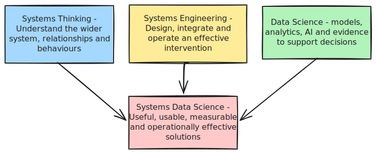
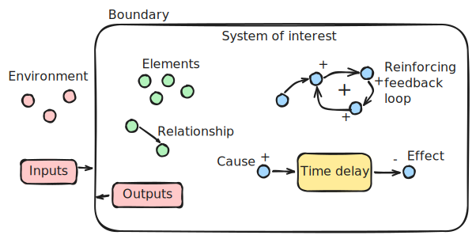
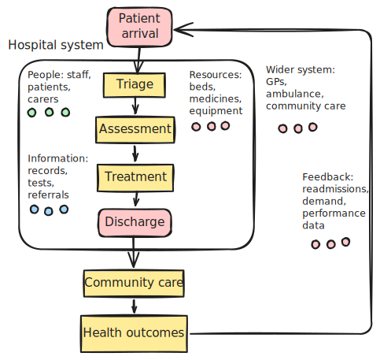
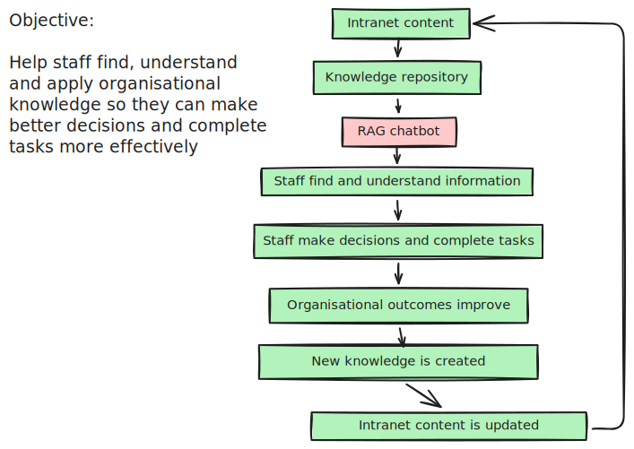
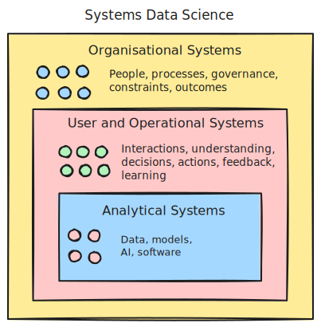

# Systems Data Science

*Piers Walker, July 2026*

Systems Data Science combines systems thinking, systems engineering and applied data science to develop solutions that work in practice.

The central idea is that an analytical model, machine learning system or AI tool is rarely useful in isolation. It operates within a wider system of people, processes, information, technology, policies and constraints.

A technically strong solution can still fail if users do not trust it, if it does not fit existing workflows, if the data is poorly governed, or if success is measured using metrics that do not reflect the real intended outcome.

Systems Data Science therefore looks beyond machine learning models. It asks how analytical and AI components interact with the wider system, how they support real user's activities, how performance can be measured, and how the solution can operate reliably over time.

## Contents

- [A practical Systems Data Science approach](#a-practical-systems-data-science-approach)
- [What is systems thinking?](#what-is-systems-thinking)
- [Some useful systems concepts](#some-useful-systems-concepts)
- [A hospital as a system](#a-hospital-as-a-system)
- [From systems thinking to systems engineering](#from-systems-thinking-to-systems-engineering)
- [What Systems Data Science looks like in practice](#what-systems-data-science-looks-like-in-practice)
- [Questions a systems thinker might ask](#questions-a-systems-thinker-might-ask-about-a-data-science-product)
- [Case study: an internal AI chatbot](#case-study-applying-systems-data-science-to-an-internal-ai-chatbot)
- [Responsible and safe AI](#responsible-and-safe-ai)
- [What changes in practice?](#what-changes-in-practice)
- [Systems Data Science summary](#systems-data-science-summary)

## A practical Systems Data Science approach

One practical way to think about Systems Data Science is as a continuous process of understanding, designing, integrating, evaluating and improving.

**Understand the wider system** – define the problem, system boundary, users, stakeholders, workflows, data sources, constraints and dependencies. Looking beyond the immediate technical task to better understand the outcome the intervention is intended to improve.

**Design the intervention** – develop the analytical or AI components alongside the surrounding processes, interfaces, controls and responsibilities needed for them to work effectively.

**Integrate with real workflows** – consider how the solution will operate within existing technology, organisational processes and decision-making. A technically successful model may still fail if it introduces friction or does not fit the way people actually work.

**Evaluate at multiple levels** – measure more than model performance. Consider technical quality, user understanding and task completion, operational effects and wider organisational outcomes.

**Learn and improve over time** – use monitoring, feedback, failure analysis and changing user needs to improve both the technical components and the wider system in which they operate.

Systems thinking provides the foundation for understanding the wider context in which data science solutions operate.

## What is systems thinking?

Systems thinking is a way of looking at the world — especially the messy bits where people, technology, processes and incentives all interact.

When people face a complex problem, they often try to understand it by breaking it into smaller parts and examining each part separately. This reductionist approach has been hugely successful in both science and engineering, particularly for understanding and building complicated technologies.

However, it can fall short when we use it to analyse complex systems, where behaviour often emerges from interactions between components rather than from the components alone — particularly when some of those components are people.

Systems thinking takes a different perspective. It recognises that some behaviours and properties only become clear when we look at the system as a whole, including the relationships between its parts. Interactions can produce non-linear, delayed and sometimes surprising effects.

A business or organisation, for example, is a system made up of people, policies, processes, technology and information. Systems thinking looks at how these components interact: people follow policies, use technology, generate information and communicate with one another.

Organisational culture is an emergent property. It does not sit inside any single component of the organisation; it arises from the way those components interact. Changing one part of the system can therefore affect the behaviour of the organisation as a whole, even where that effect would not be obvious from examining the individual component in isolation.

## Some useful systems concepts

Systems can be simplified to make them easier to understand, but simplification should not mean ignoring how the system works as a whole.

Some useful concepts include:

* **System of interest** – the system or problem area being considered
* **System boundary** – what is included within the system being studied
* **Environment** – the wider context outside the boundary and in which the system has to operate
* **Inputs and outputs** – the information, resources or actions that enter and leave the system
* **Elements** – the individual parts that make up the system
* **Relationships** – how elements interact with and influence one another
* **Feedback loops** – where changes in one part of the system eventually influence that same part again
* **Time delays** – gaps between an action and its effects
* **Emergence** – behaviour or properties that arise from interactions across the system rather than from any individual component

**Feedback loops** are particularly important.
A reinforcing loop amplifies change. This can produce either beneficial or harmful effects. A balancing loop acts to resist change or move the system towards a particular state or target.

**Time delays** are also important because they can make systems difficult to manage. The consequences of an action may only become visible weeks, months or years later, by which point the original cause may no longer be obvious.

Here is an illustration of some of these components:

## A hospital as a system

To make this more concrete, consider a hospital.

At first glance, it might look like a collection of departments: A&E, wards, diagnostics, theatres, pharmacy and discharge teams.

From a systems-thinking perspective, however, the hospital is better understood as a network of people, resources, information and processes working together to improve patient outcomes.

The important point is that the hospital does not operate in isolation. It is affected by GP services, ambulance services, community care, staffing, funding, regulation and patient demand.

A problem that becomes visible inside the hospital may therefore have its cause somewhere else in the wider system.

For example, A&E congestion may appear to be an emergency department problem. But pressure in A&E may be partly caused by delayed patient discharge, which may itself be related to a lack of available social care or community support.

The place where a problem becomes visible is not necessarily the place where its cause sits.

### Understanding the system using POTI

One simple way of avoiding an overly technology-focused view is to examine the system through **Process, Organisation, Technology and Information (POTI)**.

| POTI category | Examples in a hospital system                                                                                        |
| ------------- | -------------------------------------------------------------------------------------------------------------------- |
| Process       | admission, triage, diagnosis, treatment, discharge, follow-up care                                                   |
| Organisation  | patients, nurses, doctors, administrators, managers, carers, ward teams, diagnostic teams                |
| Technology    | electronic patient record systems, diagnostic equipment, monitoring devices, scheduling systems, communication tools |
| Information   | patient records, test results, referrals, clinical guidelines, bed status, discharge plans                           |

Other important considerations include resources, constraints and the wider system:

| Category                  | Examples                                                                                        |
| ------------------------- | ----------------------------------------------------------------------------------------------- |
| Resources and constraints | beds, medicines, equipment, staff time, funding, physical space, theatre capacity               |
| Wider system              | GPs, ambulance services, community care, social care, public health, regulation, patient demand |

Here is a simplified illustration of an admissions process:

## From systems thinking to systems engineering

Systems thinking helps us understand the wider problem and the relationships between different parts of a system.

Systems engineering focuses on turning that understanding into a designed, integrated and operable solution.

For a data science project, this might include:

* defining the real operational need
* identifying users and stakeholders
* understanding workflows and dependencies
* translating needs into requirements
* integrating data, models, interfaces and existing technology
* considering reliability, safety and maintainability
* testing whether the complete solution works in practice
* monitoring performance and improving the system over time

The distinction is useful: systems thinking helps us understand the problem landscape, while systems engineering helps us design and operate an effective intervention within it.

## What Systems Data Science looks like in practice

Systems Data Science applies analytical and AI methods as part of wider socio-technical systems.

The key shift is in perspective since a data science model or AI tool is one component within a larger socio-technical system.
It will usually depend on external data, be used by people within an existing workflow and produce outputs that influence human behaviour, decisions or other systems.

A narrow technical view might ask how the model is performing, whereas a systems view asks whether the intervention improves the outcome we actually care about.

For example:

| Narrow technical view      | Systems view                                         |
| -------------------------- | ---------------------------------------------------- |
| Is the model accurate?     | Does the intervention improve the intended outcome?  |
| Are retrieval results relevant?     | Can users find and apply the information they need?  |
| Is the interface usable?   | How does the tool change workflow and behaviour?     |
| Does the model work today? | How does the wider system learn and adapt over time? |

Applying systems thinking can help avoid:

* optimising the wrong metric
* building technically excellent tools that nobody uses
* ignoring human and organisational factors
* shifting risk or workload elsewhere in the system

The value of a project does not come from the model alone. It emerges from the interaction between information, technology, organisational context, human understanding and the decisions or outcomes that follow.

## Questions a systems thinker might ask about a data science product

A systems-thinking approach changes the questions we ask.

| Area                        | Questions to consider                                                                                                                                                                                       |
| --------------------------- | ----------------------------------------------------------------------------------------------------------------------------------------------------------------------------------------------------------- |
| **Data**                    | Where does the data come from, and why was it generated? What biases, gaps or assumptions might be present? Who owns and maintains the data? How quickly does it become out of date?               |
| **Users**                   | Who uses or acts on the outputs? What actions or decisions are they trying to make? What level of explanation do they need? How might their behaviour change once the tool is available?           |
| **Workflow**                | Where does the tool fit into existing workflows? What happens if the tool is ignored, misused or relied upon too heavily? What teams, systems or processes are affected?                              |
| **Feedback**                | How can users provide feedback? How will errors, edge cases and unexpected uses be detected? How will the system be updated over time?                                                                |
| **Outcomes**                | What outcomes should improve, and how will we know? Are we measuring model performance, user experience or organisational effect? Over what period should benefits and harms be assessed?             |
| **Unintended consequences** | Could the tool create incentives for unhelpful behaviour? Could it move work, risk or responsibility onto another part of the organisation? What might happen if people over-trust or under-trust it? |

## Case study: applying Systems Data Science to an internal AI chatbot

<mark>Case study: applying Systems Data Science to an internal AI chatbot</mark>

### Introduction
Consider an internal chatbot that uses Retrieval Augmented Generation (RAG) to help staff find and understand HR policies and guidance from an organisation's intranet.

This provides a useful example of Systems Data Science because the technical AI system is only one part of the intervention. Success also depends on content quality, user behaviour, workflow integration, trust, governance, feedback and operational support.

A typical technical framing of the problem might be:

> Generate accurate answers to user queries using a set of documents.

A systems-thinking framing is broader:

> Help staff find, understand and apply organisational knowledge so they can make better decisions and complete tasks more effectively.

The second framing changes the project considerably. The chatbot is no longer the whole intervention but becomes one component within a wider organisational knowledge system.

### Technical versus systems perspective

An exclusively technical perspective might focus on the main components of the solution, such as embeddings, the vector database, search and retrieval, and the system prompt.

A systems-thinking perspective recognises that these technical components sit within a much larger organisational system:

The technical pipeline is still important, but it is only one part of the system.

### System components

Applying the same POTI lens to the chatbot:

| POTI category | Examples |
| ------------- | -------- |
| Process       | content creation, content review, publishing, search and retrieval, chatbot use, escalation to HR or line managers, feedback collection, maintenance |
| Organisation  | staff users, content owners, subject matter experts, HR teams, senior sponsors |
| Technology    | intranet, search service, RAG pipeline, vector database, large language model, analytics and monitoring tools |
| Information   | policies, guidance, source documents, user feedback, usage data, historical decisions |

The quality of the chatbot depends on interactions across these components. A problem that becomes visible in the final answer may originate in the source information, content management process, retrieval pipeline, model behaviour, user interaction or interface design.

Treating every poor answer as an LLM problem therefore risks improving the wrong part of the system.

### Interaction and feedback loops

Once system components have been identified, their interactions can be mapped.

For example, good chatbot answers can contribute to greater user trust. Greater trust may lead to more use of the tool. Greater use may generate more feedback and evidence about how the system performs, allowing further improvements to be made.

This can form a desirable reinforcing feedback loop:

> Better answers → greater trust → more use → more feedback → system improvement → better answers

However, a different reinforcing dynamic can develop if early performance is poor or misaligned with user needs. For example if outputs are unhelpful, poorly structured or insufficiently tailored initial trust can be reduced, leading to lower usage, which in turn reduces opportunities to collect feedback and understand real user needs. The system may then improve more slowly, reinforcing the original lack of trust.

This can damage adoption even where the underlying technical components are capable, but the overall system has not been sufficiently adapted to its users and operational context.

### Looking across the user journey

Many RAG chatbot projects focus on retrieval and answer quality. Systems thinking asks questions across the whole interaction.

| Stage | Questions to consider |
|-------|------------------------|
| **Before the chatbot** | Is the information accurate and current? Is it duplicated or contradictory? Who owns it and how is it maintained? |
| **During the chatbot interaction** | Can users formulate effective questions? Will they understand and appropriately trust the answer? Can they access and verify the source material? |
| **After the chatbot interaction** | Did the user complete their task? Did they still need to contact HR or another support team? Did the interaction reveal gaps or problems in organisational knowledge? |

### Emergent behaviour

Emergent behaviour arises from interactions across the system rather than from any single component.

Some emergent effects may be useful such as repetitive HR enquiries reduce as staff become more self-sufficient. Other effects may be harmful or unintended for example users over-trust answers or informal organisational knowledge becomes less visible.

Some of these effects may only become apparent after significant time has passed. For this reason, evaluation should consider not only technical performance, but also how the system influences user behaviour, organisational processes and outcomes over time.

### Looking upstream for causes

When a user reports a poor answer, it can be tempting to treat the problem as a failure simply of the AI model.

A systems perspective encourages us to trace the problem upstream. The same visible symptom can have several possible causes in different parts of the system.

| User complaint | Possible root cause |
|----------------|---------------------|
| Missing information | Poor retrieval, incorrect chunking, information absent from the intranet, content out of date |
| Incomplete answer | Relevant content retrieved but not used effectively in the answer |
| Vague answer | Ambiguous user question, ambiguously written or insufficient source content, irrelevant content retrieved |
| Cannot verify the answer | Source material or links are not clearly exposed |
| Difficult to use the answer | Interface or presentation does not support the user's task |

The important point is that the same visible failure can have several different causes.

Improving the model will not solve a content governance problem. Improving retrieval will not solve an ambiguous policy. Rewriting the interface will not help where the necessary information does not exist.

### Evaluating and operating the system

#### Measuring performance at multiple levels

Systems Data Science requires evaluation at more than one level. A model can meet its technical performance targets while the overall intervention fails to improve user outcomes or organisational performance. The choice of measures depends on what the organisation is actually trying to improve.

Here are some metrics at different levels:

| Measure type | Measures |
|--------------|----------|
| **Technical** | Retrieval precision, retrieval recall, groundedness, answer accuracy, response time |
| **User** | Task completion, time to find information, user understanding, satisfaction, appropriately calibrated trust |
| **Operational** | Demand on HR or support teams, repeated enquiries, time spent finding information, onboarding time |
| **Organisational** | Policy compliance, knowledge sharing, quality of organisational content, reduced organisational friction, productivity or time saved |

#### Operational reliability

A solution that performs well in a demonstration or controlled test may still fail operationally.

A Systems Data Science approach therefore also considers questions such as:

* What happens when source data is missing or delayed?
* How are failures detected?
* How does the system behave when it is uncertain?
* Who is responsible for responding to problems?
* How are models, prompts, source content or business rules updated?
* What happens when user behaviour or the wider organisation changes?

Operational effectiveness depends not only on average model performance, but on whether the complete system can be monitored, maintained and trusted in real use.

## Responsible and safe AI

A systems-thinking approach should consider responsible AI across the whole AI system rather than treating it as a final technical check.

Risks can arise at many points. Data may under-represent certain groups or circumstances; models may perform differently across users or scenarios; interfaces may encourage inappropriate trust; and organisational processes may fail to provide sufficient oversight or escalation. 
In systems using large language models, further risks can arise from inconsistent outputs, unsupported claims, sensitivity to phrasing and attempts to manipulate the system.

### Fairness and bias

Bias can enter through data, model behaviour, system design and the way outputs are used. Testing should therefore consider whether different groups, scenarios or ways of interacting with the system receive consistently fair treatment.

Approaches include:

* **paired or counterfactual testing**, where otherwise equivalent inputs are varied by characteristics such as gender, age or other relevant attributes
* **performance comparisons**, checking whether accuracy, completeness, relevance, error rates or refusal rates differ across groups or types of scenario
* **coverage testing**, identifying groups, situations, topics or edge cases that are poorly represented in the underlying data or knowledge base
* **consistency testing**, checking whether similar inputs lead to appropriately similar outputs and whether irrelevant differences cause unexpected changes
* **language robustness testing**, examining whether spelling or different ways of expressing the same thing materially affect performance

### Safety and trustworthiness

Responsible AI assurance should also consider whether the system is reliable, secure and appropriate for its intended use.

**Accuracy and reliability:** test whether outputs are correct, sufficiently complete and suitable for the decisions or actions they support. For generative systems, assess whether important caveats are preserved and whether any unsupported claims are introduced.

**Safety and inappropriate content:** test sensitive, adversarial, ambiguous and unexpected inputs to determine whether the system behaves appropriately and avoids producing harmful, misleading or unsuitable outputs.

**Privacy and confidentiality:** assess whether personal or sensitive information could be exposed, and whether access controls remain effective throughout the system.

**Security and robustness:** test resistance to attempts to manipulate the system, bypass safeguards or extract confidential information. For LLM-based systems, this can include prompt injection and attempts to override system instructions.

**Transparency and explainability:** users should understand when AI is being used, what role it plays, its main limitations and how much confidence they should place in its outputs. Where appropriate, important outputs should be traceable to supporting evidence or data.

### Governance and monitoring

Responsible AI should continue throughout the lifecycle of the system, including after deployment.

**Human oversight and escalation:** make clear when human judgement is required and provide appropriate routes for review, challenge or escalation, particularly for high-impact cases.

**Monitoring after deployment:** continue evaluating system performance, errors, failed interactions, user feedback, changing usage patterns or changes in the underlying data.

**Governance and accountability:** define clear responsibilities for system ownership, data quality, model changes, monitoring and decisions about whether the system remains appropriate for continued use.

From a systems-thinking perspective, the important question is not only whether an individual model is fair, accurate or safe. It is whether the interaction between data, models, interfaces, people, incentives and operational processes produces outcomes that are fair, safe, trustworthy and appropriate for the system's intended purpose.

## What changes in practice?

Applying systems thinking does not mean abandoning technical work or turning every data science project into a large organisational transformation exercise.

It means asking a wider set of questions.

In practice, a data scientist or AI team may spend more time:

* understanding the problem boundary
* mapping stakeholders and workflows
* identifying dependencies outside the technical system
* looking upstream for causes of poor performance
* considering how users might adapt their behaviour
* identifying useful feedback loops
* understanding delays between intervention and outcome
* evaluating outcomes beyond model metrics

This does not make modelling less important. It helps ensure that modelling effort is directed at the right problem.

## Systems Data Science summary

Systems Data Science combines systems thinking, systems engineering and applied data science.

It treats analytical models and AI tools as components within wider systems of people, processes, information, technology, policies and constraints.

The questions are therefore not only:

> Does the software work or is the machine learning model accurate?

They also include:

> Does the tool fit the workflow and wider operational system?

> Does the solution help real users understand something better, perform better or make better decisions?

> Is it fair, safe, trustworthy and appropriately governed?

> Can it perform reliably and improve over time?

> Does it create meaningful benefits, avoid unintended consequences and clearly demonstrate its impact and usefulness?

In the case of a RAG chatbot, this means looking beyond retrieval and answer generation. The wider challenge is to improve how organisational knowledge is created, maintained, discovered, understood and acted upon, while ensuring that the system behaves responsibly and that risks are monitored and managed throughout its lifecycle.

Systems thinking does not replace technical excellence in data science; it gives it somewhere useful to land.

The aim of Systems Data Science is to build analytical and AI-enabled solutions that are not only technically capable, but useful, usable, measurable, responsible and operationally effective.

---
**←[Back to home page](https://pierswalker71.github.io)**
